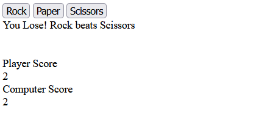

# Rock-Paper-Scissors Game

This project uses HTML and Javascript to build a basic Rock-Paper-Scissor game.

## The Odin Project: Lesson Rock Paper Scissors

This project is build according to the specification of the [Rock Paper Scissors lesson](https://www.theodinproject.com/lessons/foundations-rock-paper-scissors)

## Live website

A rock-paper-scissors game which prompts user for an input and randomly generates a computer's input.
The game lasts five rounds and each round the result is displayed in your browsers console.
After the last round a message in the console displays who won with what score or if it was a draw.

Open your browser's console (for ex. press 'F12') to read messages.

Access the [Rock Paper Scissors game](https://gohan61.github.io/rcs-game/)

Note: this project is another try/implementation of this [repository](https://github.com/Gohan61/rcs-game2)
